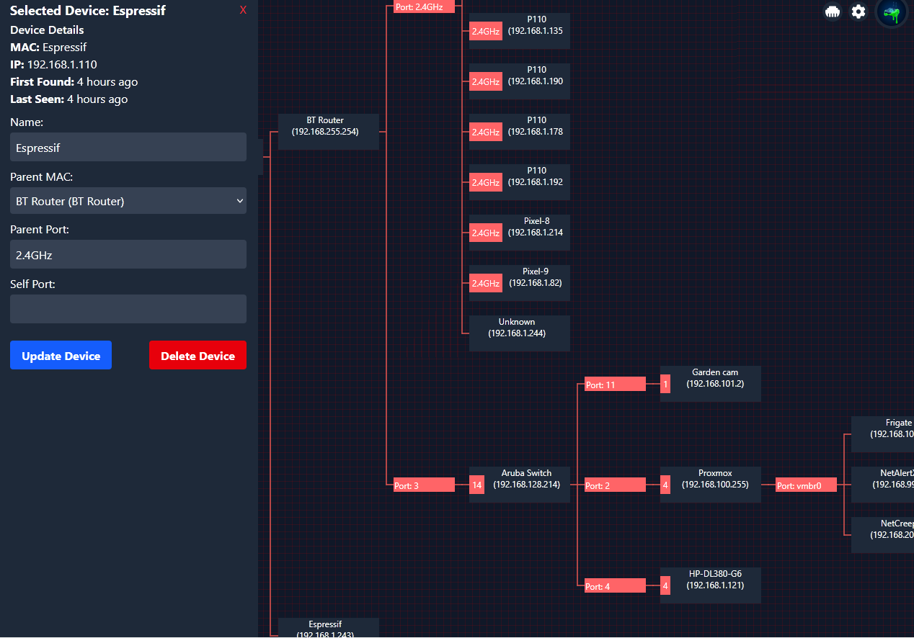
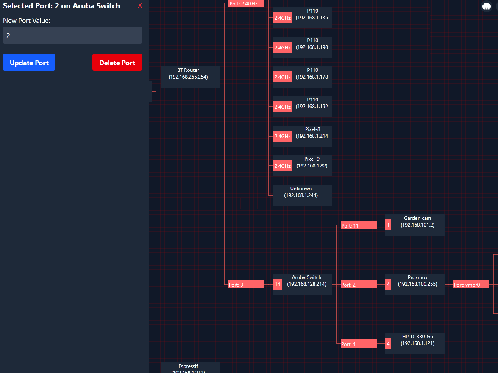
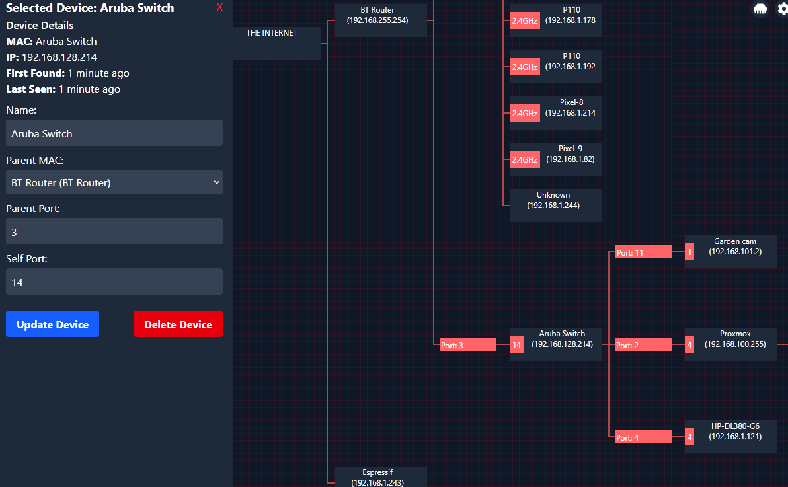

# NetCreep
NetCreep is a modern fast network mapper designed from the ground up to have a responsive UI

Visually Explor your network

(psst you can hide the MAC's for screenshots ect)

Features list to come, check the closed issues for now

Alternatives

- [PiAlert by leiweibau](https://github.com/leiweibau/Pi.Alert/) (maintained, bare-metal install)
- [WatchYourLAN](https://github.com/aceberg/WatchYourLAN) - Lightweight network IP scanner with web GUI (Open source)
- [Fing](https://www.fing.com/) - Network scanner app for your Internet security (Commercial, Phone App, Proprietary hardware)
- [NetBox](https://netboxlabs.com/) - Network management software (Commercial)
- [NetAlertX](https://netalertx.com/) - Visualize all your networks in one place
